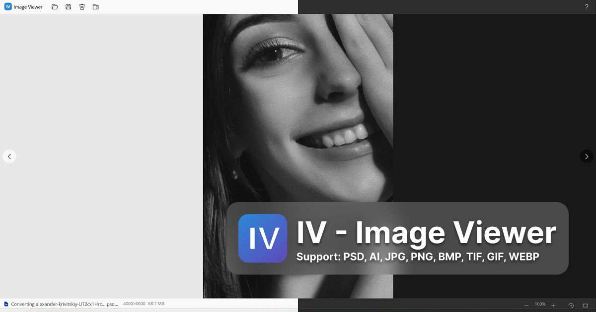
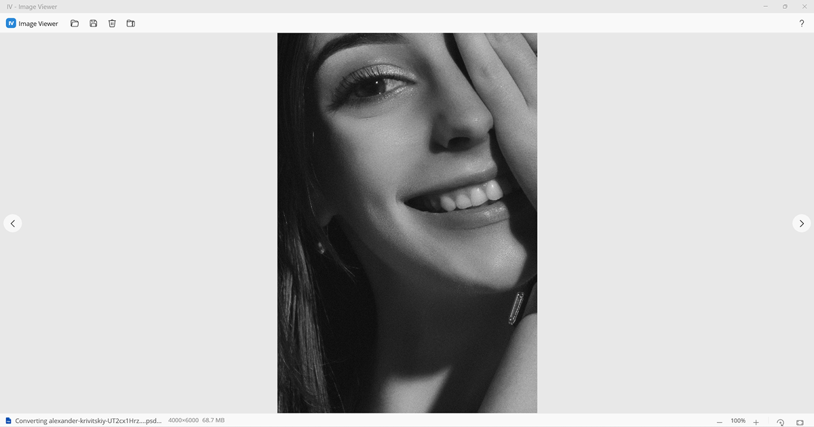
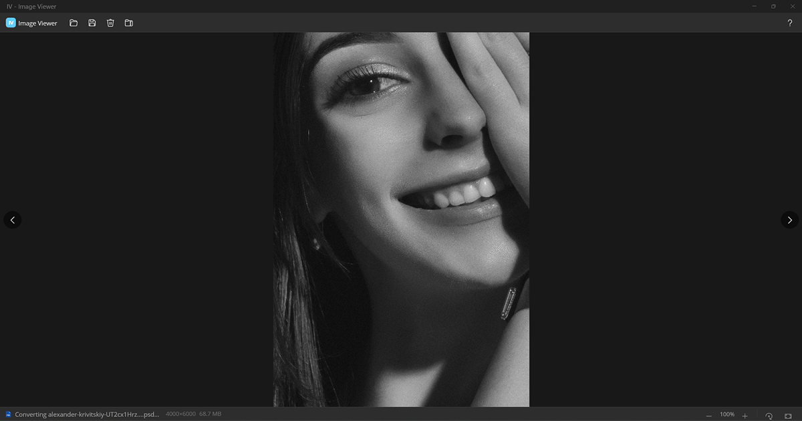
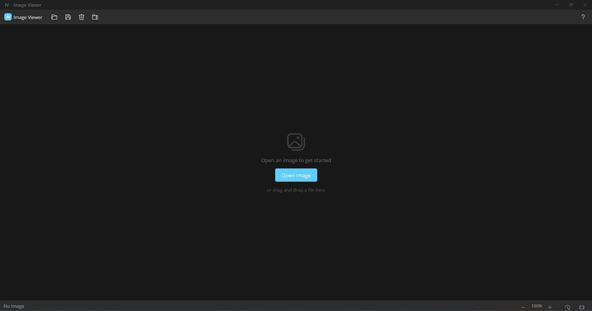

# IV - Image Viewer

A lightweight, fast image viewer built for designers. Open PSD, AI, and EPS files instantly — no Adobe software needed.

## ✨ Features

- **Open PSD & AI files instantly** — no Photoshop or Illustrator required
- **10 formats supported** — PSD, AI, EPS, PNG, JPG, BMP, GIF, TIFF, WebP
- **Drag & Drop** — just drop files to view
- **Export to PNG** — convert any format to PNG
- **Compress to JPEG** — with file size comparison
- **Keyboard shortcuts** — full keyboard navigation
- **Windows 11 Fluent Design** — Mica backdrop, dark/light theme
- **EXIF data** — camera info, dimensions, dates
- **File navigation** — browse all images in folder with arrow keys
- **Zero telemetry** — fully offline, no data collection

## ⌨️ Keyboard Shortcuts

| Shortcut | Action |
|---|---|
| `Ctrl+O` | Open file |
| `Ctrl+E` | Export PNG |
| `Ctrl+C` | Copy to clipboard |
| `Del` | Delete to Recycle Bin |
| `← →` | Previous / Next image |
| `R` | Rotate 90° |
| `Ctrl++ / -` | Zoom in / out |
| `Ctrl+0` | Fit to screen |
| `Mouse Wheel` | Smooth zoom |
| `Double-click` | Toggle zoom |
| `Right-click` | Context menu |

## 📋 System Requirements

| Requirement | Specification |
|---|---|
| **OS** | Windows 10 (64-bit) v1809+ or Windows 11 |
| **Processor** | x64, 1 GHz or faster |
| **RAM** | 4 GB minimum |
| **Storage** | 200 MB |
| **Runtime** | .NET 10 Desktop Runtime (included in installer) |

## 📸 Screenshots

| Light Mode | Dark Mode |
|---|---|
|  |  |
|  |  |

## 📥 Download

**[Download IV-ImageViewer-Setup-1.0.0.exe](https://uxbyissa.com/iv)**

SHA256: `See CHECKSUM.txt`

## 🛠️ Built With

- [.NET MAUI](https://dotnet.microsoft.com/apps/maui) — Cross-platform UI framework
- [ImageMagick](https://imagemagick.org/) via Magick.NET — Image conversion
- [MetadataExtractor](https://github.com/drewnoakes/metadata-extractor-dotnet) — EXIF reading
- [Inno Setup](https://jrsoftware.org/isinfo.php) — Installer

## 📖 The Story

This program was built during the 2023 war in Gaza. No electricity, no internet — just solar power and determination. It was my way of fighting back, of saying "You can't break me."

If you dig what I'm doing, please support a fellow designer.

## 💰 Support

- **USDT**: `TYASr7jkpzLuHG8gQcKKgk5AXTjQnwmCeY`
- **Email**: isabaro@gmail.com
- **Website**: [uxbyissa.com](https://uxbyissa.com)

## 📄 License

Freeware — Free for personal and commercial use. See [LICENSE.txt](LICENSE.txt) for details.

Copyright © 2024-2025 [@uxbyissa](https://uxbyissa.com). All rights reserved.

Made with ❤️ from Gaza, Palestine.
